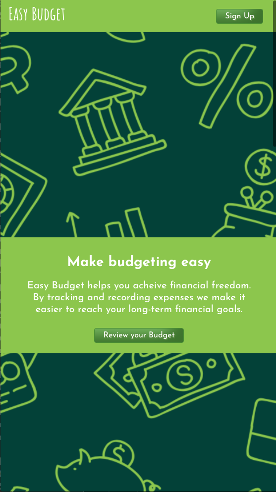
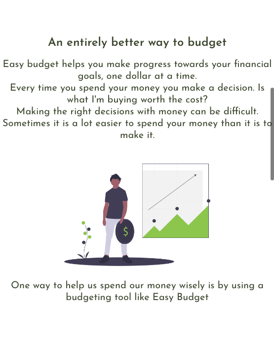
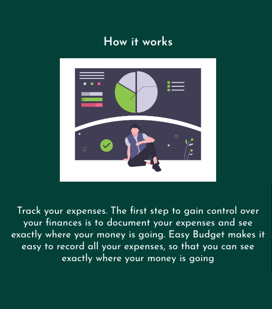
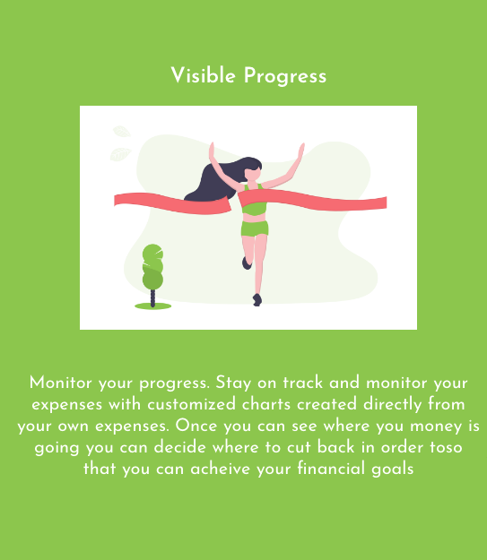

# Thinkful Full Stack Capstone - Easy Budget App Client

## Programmer
Chanda Hubbard

# 

While enrolled in Thinkful's Web Development bootcamp I created this Full-stack Capstone project.  Easy budget is an interactive web application that was created to view and manage your monthly budget.  This app was created so that you can view all of your monthly expenses and figure out whether they align with your financial goals.

Link to the [Live URL application](https://easy-budget.chandacodes.vercel.app)

# Technology Used
### Front-end
- React
    - Router
    - Context
    - Libraries
        - Sweet Alerts
- HTML
- CSS
- Vercel(Zeit)

### Back-end
- Node.js
- Express
    - Knex
    - Mocha, Chai & Supertest
- PostgreSQL
    - Elephant SQL
- Heroku

## Summary

<!-- <b>Dinner and a Movie</b> is a responsive web app that helps users decide where to order dinner and which movie to watch for a fun night in.  Users input their location and it is sent to the [EatStreet API Endpoint](https://developers.eatstreet.com/endpoint/search) to find restaurants that provide food delivery or pickup nearby. Users will then navigate to a screen where they can input a movie that they like so that they can receive similar movie recommendations using the [TasteDive Movie API Endpoint](https://tastedive.com/read/api)  -->

#### Landing Page

#### Signup Button

- From the landing page click the signup button to view a signup alert.  
- From there you can leave your email address to be notified of future app updates.  
- This alert was created with <b>Sweet Alerts</b>

#### Review your budget screen

- From the landing page click the <b>Review your Budget</b> button to navigate to the `/budget` page.  
- On this page a list of expenses can be viewed in a <b>HTML table</b> that renders a database of expenses which were created with <b>PostgreSQL</b>.  
- The database is pre-populated with default expenses.  
- Click the <b>Delete</b> button to remove expenses.
- Expenses can be added with the <b>Update Budget</b> button and then the app will navigate to the add and expense page.

#### Create an expense screen

- Once the <b>Update Budget</b> button is clicked the app navigates to the `/create` page

- Enter information for the new expense in the form and click the <b>Add Expense</b> button

- Once the <b>Add Expense</b> button has been click an alert will appear to let you know that the expense has been created. 

#### Not Found screen

- If the user tries to navigate to a page that does not have a route `/*` the Not Found page will be displayed
- This feature was created with <b>React Router</b>

## Easy Budget API
Link to the [API Repo](https://github.com/ChandaHubbard/easy-budget-app-api)
<!-- 

Documentation of your API.
Screenshot(s) of your app. This makes your app description much easier to understand.
A summary section. This should have a concise explanation of what your app does. Try to frame this from the standpoint of what the user does, or what the app enables for the user.
A section on the technology used. -->
<!-- 

## Process

<!-- ##### [> Initial wireframes<](https://docs.google.com/document/d/16hyz31opJRNBHMy4-gDB9pLsdS5OK1MZCCaQCb7vhCo/edit?usp=sharing) -->

<!-- ### Wireframe images -->
<!-- 

##### [> Initial User Stories<](https://docs.google.com/spreadsheets/d/1FB6xBWHgIpJLK6rlRdFN-CHQ4ed_Hvct-nbLKT8k22w/edit?usp=sharing) -->
<!-- 
### Version MVP (Minimal Viable Product) -->

<!-- [>MVP<](https://chandahubbard.github.io/API%20Hack%20Capstone/index.html) -->

### Styling with a little bit of CSS

<!-- After researching the <i>Psychology of Color</i>, I decide that I would either choose a red or orange color scheme for my styling.  Red, because it symbolizes entertainment, for the movie portion of the app. Or orange, because it symbolizes food/hunger, for the food delivery portion of the app.  I ended up with a red based color theme from Adobe called,  [Sosialisasi Speak Up 19](https://color.adobe.com/Sosialisasi-Speak-Up-19-color-theme-14114879/https://color.adobe.com/Sosialisasi-Speak-Up-19-color-theme-14114879/) , which can be viewed below.

 

 

## Final version at different breakpoints

### Mobile

### Tablet

### Desktop/other

 -->

## Final version & User Flows
<!-- 
### Screen 1 
#### Landing Page which Navigates to a Dinner Input screen once the "Let's Go" button is clicked 

### Screen 2
#### Dinner Input screen, where the user can provide their location and select delivery and pickup options

### Screen 3
#### Flows the user from the dinner input screen to the movie input screen once the "Find a Movie" button is clicked

### Screen 4
#### Movie input screen that allows used to provide a movie they would like to see similar recommendations for

### Screen 5
#### Flows the user from the movie input screen to the results screen once the "View Dinner & Movie Pairing" button is clicked

### Screen 6
#### Flows the user to the results screen where they can view their restaurant recommendation and their movie recommendation.

### Additional Screens
#### The user can then select the "restart the app" button which navigates back to screen one and clears all results or they can select the "View more recommendations" button to view screen 6 with different movie and restaurant results. -->

<!-- ## Other features to implement in future versions -->

<!-- [ ] Figure out how to handle edge cases for movie input
 
[ ] Incorporate an additional API that will let the user know which streaming service currently offers their movie selection for viewing. -->

 -->

## Scripts

- To start the application enter `npm start` in the terminal

- To run the test suite enter `npm test` in the terminal

## Deployment

- To deploy the app enter `npm run build` then `npm run deploy` in the terminal
